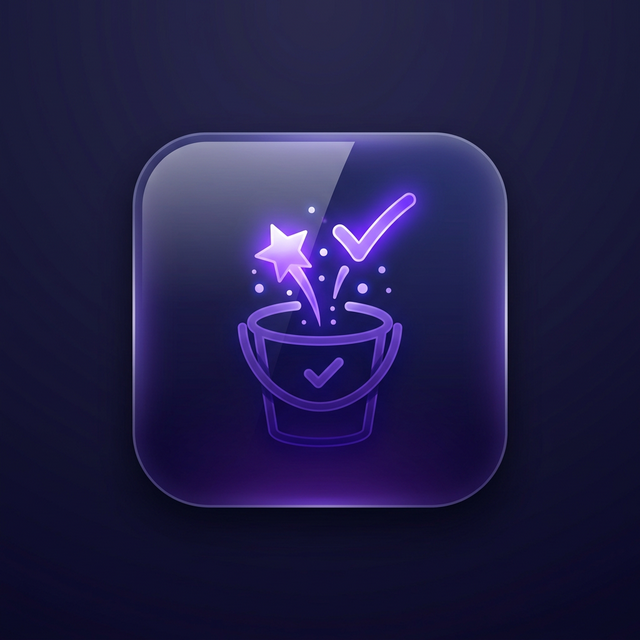

  
  <h1>🌟 Lony's Bucket List 🌟</h1>
  
<em>Your dreams, milestones, and adventures—beautifully organized.</em>

  
  
  
  

---

### 📖 Table of Contents
- [✨ Key Features](#-key-features)
- [👤 User Guide](#-user-guide)
  - [How to Use](#how-to-use)
  - [Moving Your Data](#moving-your-data)
- [💻 Developer Guide](#-developer-guide)
  - [Tech Stack](#-tech-stack)
  - [Getting Started](#-getting-started-locally)
- [🗺️ Roadmap](#️-roadmap)

---

## ✨ Key Features
Lony's Bucket List is a completely standalone, portable Windows Desktop Application. Designed with **minimalism**, **high-performance glassmorphism**, and **uncompromising privacy**.

- **🚀 Zero Installation:** Simply double-click to launch.
- **🔒 Absolute Privacy:** 100% offline. Your data stays on your machine.
- **📂 Tabbed Organization:** Seamlessly switch between bucket list categories.
- **📸 rich Media Attachments:** Attach images, videos, audio, and documents.
- **⚡ Supercharged Storage:** High-speed local persistence with atomic safety.
- **🎉 Celebration Engine:** Delightful animations for every goal you crush!

---

## 👤 User Guide

**Welcome to your journey!** Capture your dreams securely on your own machine.

### How to Use
1. **Launch:** Open `LonysBucketList-1.0.0-portable.exe` instantly.
2. **Groups:** Categories your dreams by clicking `+ New Group`.
3. **Items:** Add a title, subtitle, and description.
4. **Media:** Click the attachment icon to link images or videos.
5. **Autosave:** Just type—the app saves your progress automatically.
6. **Achieve:** Move to `Completed` and enjoy the fireworks! 🎉

### Moving Your Data (Portability)
Your goals and media are securely saved in a folder named `lonys-bucket-list-data`, generated right next to your `.exe` file.
> ⚠️ **Important:** To migrate, you **MUST** copy both the `.exe` and the `lonys-bucket-list-data` folder together!

---

## 💻 Developer Guide

### 🛠️ Tech Stack
- **Framework:** **Electron**
- **Frontend:** **React 18** & **Vite**
- **Styling:** **Tailwind CSS v3** & **Framer Motion**
- **Media Engine:** **`sharp`**
- **Persistence:** Local `store.json` via `fs` with EPERM fallbacks.

### 🚀 Getting Started Locally
\`\`\`bash
# 1. Install dependencies
npm install

# 2. Start dev environment
npm run dev

# 3. Build standalone .exe
npm run dist
\`\`\`

---

## 🗺️ Roadmap
- [ ] ☁️ Optional encrypted cloud backup
- [ ] 🎨 Custom theme engine (Glass/Flat/OLED)
- [ ] 📅 Calendar view for time-sensitive goals
- [ ] 📱 Mobile companion app (Android/iOS)

---

  Built with ❤️ by Lony | MIT License

